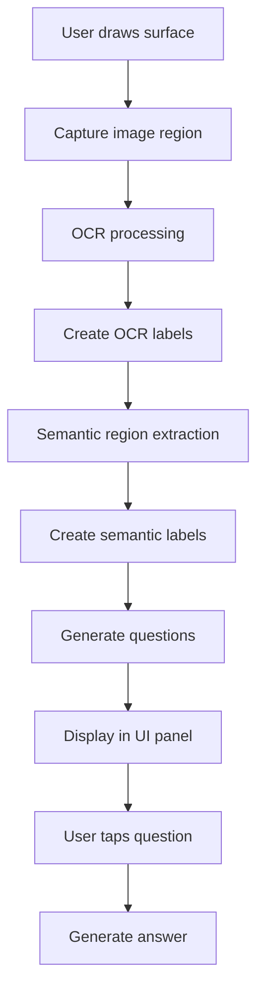

# Surface Scanning with Semantic Understanding

## Overview

This document describes the implementation of the surface scanning feature that allows users to:

1. Draw a surface in 3D space
2. Have the system automatically recognize and analyze content in that area
3. Display semantic labels on meaningful regions
4. Generate contextual questions about the content
5. Get AI-powered answers to those questions

The result is an intelligent augmented reality experience where users can simply scan a surface and get relevant information about what they're looking at.

## Key Components

### 1. Surface Drawing with `DragSurface`

Users create a rectangular surface in 3D space by indicating the four corners with pinch gestures. The `DragSurface` script handles the surface creation and emits an event when the surface is complete.

### 2. Image Capture and OCR with `CloudVisionOCRUnified`

When a surface is completed, the system:
- Captures the image from that portion of the scene
- Sends it to Google Cloud Vision API for OCR processing
- Gets back precise text content and positions

### 3. Semantic Analysis with `SurfaceScanOCR`

After OCR, the system performs a deeper semantic analysis:
- Sends the image and OCR results to Google Gemini Vision Pro
- Identifies functional regions in the image (not just raw text)
- Creates visual labels for these semantic regions on the surface

### 4. Question Generation

Based on the semantic regions, the system:
- Generates relevant questions about the content
- Displays these questions in the UI panel
- Allows users to tap questions to get detailed answers

## Implementation Details

### Surface Scanning Flow



### Key Code Components

#### 1. Surface Completion Event Handling

```csharp
private void HandleSurfaceCompleted(Vector3 point1, Vector3 point2, Vector3 point3, Vector3 point4)
{
    // Store the surface corners and prepare for OCR
    surfacePoint1 = point1;
    surfacePoint2 = point2;
    surfacePoint3 = point3;
    surfacePoint4 = point4;
    
    // Get a reference to the surface object
    lastScannedSurface = GameObject.Find("DragSurface");
    
    // Process the surface crop and perform OCR
    PerformSurfaceCrop(point1, point2, point3, point4);
}
```

#### 2. OCR Processing and Semantic Analysis

```csharp
private void HandleOCRComplete(string fullText, List<CloudVisionOCRUnified.LineData> lines)
{
    // Store the OCR results
    lastOcrFullText = fullText;
    lastOcrLines = lines;
    
    // Create OCR lines on the surface
    // [Code for creating OCR lines...]
    
    // Process semantic lines after OCR completes
    if (autoProcessSemanticLines && clearOCRSurfaceAfterGetOCR)
    {
        StartCoroutine(ProcessSemanticLinesThenClearSurface());
    }
}
```

#### 3. Semantic Line Extraction with Gemini

The `semanticLinePromptTemplate` contains our detailed prompt for Gemini Vision:

```csharp
private string semanticLinePromptTemplate = @"
You're analyzing a scanned image with OCR results **and** additional visual elements. 
Your task is to identify FUNCTIONAL AREAS in the image—not just textual lines—and 
return them in a JSON array, where each entry has:
1) A concise label (string) that describes the overall function or meaning of that region 
(for example, ""Nutrition Facts Section"" or ""USB Ports and Cable Connections"").
2) A bounding box (x, y, width, height) that fully covers all relevant text **and** any 
associated non-text elements (icons, ports, switches, etc.) belonging to that region. 

[Detailed instructions for semantic analysis...]

Output format: A strict JSON array of functional areas with bounding boxes
";
```

#### 4. Creating Semantic Labels in 3D Space

```csharp
private void CreateSemanticLines(List<SemanticLineData> semanticLines)
{
    // Create visual labels for each semantic region
    foreach (SemanticLineData line in semanticLines)
    {
        // Position the label in 3D space based on the bounding box
        Vector3 linePosition = CalculatePositionOnSurface(line.boundingBox);
        
        // Create the semantic line object
        GameObject semanticLine = Instantiate(semanticLinePrefab, linePosition, surfaceRotation, semanticLineContainer);
        
        // Configure the visual label
        // [Detailed configuration code...]
        
        // Add interactivity to the label
        var button = backgroundTransform.gameObject.GetComponent<PolySpatial.Template.SpatialUIButton>();
        button.WasPressed += (buttonText, renderer, index) => 
        {
            // Show a detailed explanation when the user taps the label
            geminiPrompter.RequestResponseWithCallback(
                ocrTextPromptTemplate, 
                semanticText, 
                (response) => PositionResponsePanel(response, semanticLine, surfaceNormal)
            );
        };
    }
    
    // Generate questions about the content
    GenerateQuestionsAfterSemanticLines(semanticLines);
}
```

#### 5. Question Generation

```csharp
private IEnumerator GenerateQuestionsRoutine(string semanticContext)
{
    // Build a prompt for Gemini to generate questions
    string prompt = $@"
        From the image you can see the user is scanning a surface on an object.
        
        Based on this object and this scan of an object with the following semantic elements: {semanticContext},
        
        Please return a JSON list of possible user questions about these elements.
        [Detailed instructions...]
    ";
    
    // Call Gemini
    var request = MakeGeminiRequest(prompt, base64Image);
    
    // Wait for completion, process response...
    
    // Create UI elements for each question
    float currentY = -60f;  // Start at the top
    float questionHeight = 54f;  // Height of each question block
    float spacing = 0f;  // Space between questions
    
    foreach (var q in questionsList)
    {
        // Create question UI element
        GameObject go = Instantiate(questionPrefab, questionsParent);
        
        // Position it correctly using the transform
        Transform t = go.transform;
        t.localPosition = new Vector3(0f, -currentY, 0f);
        currentY += questionHeight + spacing;
        
        // Set up question interactivity
        button.WasPressed += (buttonText, renderer, index) =>
        {
            // Generate answer when question is tapped
            questionAnswerer.RequestAnswer(questionText);
            answerPanel.SetActive(true);
        };
    }
}
```

## Key Implementation Features

### OCR to Semantic Understanding

The most innovative part of the implementation is how we transition from raw OCR text to meaningful semantic understanding:

1. **OCR Processing**: First, we get raw text lines with bounding boxes.
2. **Semantic Analysis**: Then, we use Gemini to identify functional regions that may include multiple text elements and even non-text elements.
3. **Visual Representation**: We display only the semantic labels to the user, as they're more meaningful than the raw OCR text.

### UI Integration for Questions

We automatically generate contextually relevant questions about the scanned content and present them in a UI panel that:
- Follows the user's view using `LazyFollow`
- Provides a clean interface for exploring the content
- Generates AI-powered answers when questions are tapped

## Usage Flow

1. User pinches four corners to create a rectangular surface
2. System processes the image, initially showing OCR text labels
3. System replaces OCR labels with semantic understanding labels
4. Question panel appears with contextual questions
5. User can tap semantic labels for explanations
6. User can tap questions for more detailed answers

## Improvements and Future Work

- **Optimize performance**: Currently, the system makes multiple API calls that could potentially be combined
- **Enhanced question relevance**: Refine the prompt to generate more insightful questions
- **Better UI positioning**: Improve the placement of labels and panels for a more intuitive experience
- **Support for more complex surfaces**: Currently limited to rectangular regions 